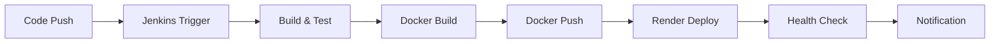

# 🚀 Guide de Configuration CI/CD

Ce guide détaille la configuration complète du pipeline CI/CD avec Jenkins, Docker Hub et Render.

## 📋 Table des matières

- [Vue d'ensemble du pipeline](#vue-densemble-du-pipeline)
- [Configuration Jenkins](#configuration-jenkins)
- [Configuration Docker Hub](#configuration-docker-hub)
- [Configuration Render](#configuration-render)
- [Intégration des services](#intégration-des-services)
- [Tests et validation](#tests-et-validation)
- [Monitoring et alertes](#monitoring-et-alertes)
- [Dépannage](#dépannage)

## 🎯 Vue d'ensemble du pipeline



## 🔧 Configuration Jenkins

### 1. Installation et configuration de base

#### Prérequis système
```bash
# Ubuntu/Debian
sudo apt update
sudo apt install openjdk-11-jdk wget curl

# CentOS/RHEL
sudo yum install java-11-openjdk wget curl
```

#### Installation Jenkins
```bash
# Ajouter la clé GPG
wget -q -O - https://pkg.jenkins.io/debian/jenkins.io.key | sudo apt-key add -

# Ajouter le repository
echo deb https://pkg.jenkins.io/debian binary/ | sudo tee /etc/apt/sources.list.d/jenkins.list

# Installer Jenkins
sudo apt update
sudo apt install jenkins

# Démarrer Jenkins
sudo systemctl start jenkins
sudo systemctl enable jenkins
```

#### Configuration initiale
1. Accédez à `http://localhost:8080`
2. Récupérez le mot de passe initial :
```bash
sudo cat /var/lib/jenkins/secrets/initialAdminPassword
```
3. Installez les plugins suggérés
4. Créez un utilisateur administrateur

### 2. Installation des plugins requis

```bash
# Plugins essentiels
- Pipeline
- Docker Pipeline
- Git
- GitHub
- Credentials Binding
- AnsiColor
- Timestamper
- Build Timeout
- Checkstyle
- SpotBugs
- HTML Publisher
- Test Results Analyzer
- Blue Ocean
- Docker
- Docker Compose Build Step
```

### 3. Configuration des credentials

#### Docker Hub Credentials
1. Allez dans **Manage Jenkins** > **Manage Credentials**
2. Sélectionnez **Global** > **Add Credentials**
3. Type : **Username with password**
4. ID : `dockerhub-credentials`
5. Username : Votre nom d'utilisateur Docker Hub
6. Password : Votre token d'accès Docker Hub

#### GitHub Credentials
1. Générez une paire de clés SSH :
```bash
ssh-keygen -t rsa -b 4096 -C "jenkins@yourcompany.com"
```
2. Ajoutez la clé publique à votre compte GitHub
3. Dans Jenkins, ajoutez la clé privée :
   - Type : **SSH Username with private key**
   - ID : `github-credentials`
   - Username : `git`
   - Private Key : Contenu de la clé privée

#### Render API Key
1. Récupérez votre clé API depuis le dashboard Render
2. Dans Jenkins :
   - Type : **Secret text**
   - ID : `render-api-key`
   - Secret : Votre clé API Render

### 4. Configuration du job pipeline

1. Créez un nouveau **Pipeline** job
2. Nom : `spring-boot-demo-pipeline`
3. Dans **Pipeline** :
   - Definition : **Pipeline script from SCM**
   - SCM : **Git**
   - Repository URL : `https://github.com/Cheeikh/221-java-project.git`
   - Credentials : `github-credentials`
   - Script Path : `Jenkinsfile`
   - Branch : `*/main`

### 5. Configuration des webhooks GitHub

1. Allez dans votre repository GitHub
2. **Settings** > **Webhooks** > **Add webhook**
3. Payload URL : `http://your-jenkins-server:8080/github-webhook/`
4. Content type : `application/json`
5. Events : `Just the push event`

## 🐳 Configuration Docker Hub

### 1. Création du repository

1. Connectez-vous à Docker Hub
2. Cliquez sur **Create Repository**
3. Nom : `spring-boot-demo`
4. Visibilité : **Public** ou **Private**
5. Description : `Spring Boot Demo Application`

### 2. Configuration des webhooks

1. Allez dans votre repository
2. **Webhooks** > **Create Webhook**
3. Webhook Name : `Render Deploy`
4. Webhook URL : `https://api.render.com/v1/services/YOUR_SERVICE_ID/deploys`
5. Content Type : `application/json`
6. Events : `Push` et `Tag`

### 3. Configuration des tags automatiques

Dans le Jenkinsfile, les images sont taguées automatiquement :
- `latest` : Dernière version stable
- `BUILD_NUMBER` : Numéro de build
- `GIT_COMMIT_SHORT` : Hash court du commit

## 🌐 Configuration Render

### 1. Création du service

1. Connectez-vous à Render
2. Cliquez sur **New** > **Web Service**
3. Connectez votre repository GitHub
4. Configuration :
   - **Name** : `spring-boot-demo`
   - **Environment** : `Docker`
   - **Dockerfile Path** : `./Dockerfile`
   - **Docker Context** : `.`
   - **Plan** : `Starter` ou `Standard`

### 2. Variables d'environnement

Configurez les variables suivantes dans Render :

| Variable | Valeur | Description |
|----------|--------|-------------|
| `SPRING_PROFILES_ACTIVE` | `production` | Profil Spring Boot |
| `JAVA_OPTS` | `-Xmx512m -Xms256m` | Options JVM |
| `PORT` | `10000` | Port de l'application |
| `DATABASE_URL` | `postgresql://...` | URL de la base de données (optionnel) |
| `REDIS_URL` | `redis://...` | URL Redis (optionnel) |

### 3. Configuration du déploiement automatique

1. Allez dans **Settings** > **Build & Deploy**
2. **Auto-Deploy** : `Yes`
3. **Branch** : `main`
4. **Dockerfile Path** : `./Dockerfile`

### 4. Configuration des webhooks

1. Allez dans **Settings** > **Webhooks**
2. Ajoutez un nouveau webhook :
   - **Name** : `Docker Hub Integration`
   - **URL** : `https://api.render.com/v1/services/YOUR_SERVICE_ID/deploys`
   - **Events** : `push`, `tag`

## 🔗 Intégration des services

### 1. Flux de déploiement

```bash
# 1. Push du code
git push origin main

# 2. Déclenchement Jenkins (automatique)
# - Build et tests
# - Construction image Docker
# - Push vers Docker Hub

# 3. Déclenchement Render (automatique)
# - Pull de l'image depuis Docker Hub
# - Déploiement sur Render
# - Health check
```

### 2. Script de déploiement manuel

Créez `scripts/deploy.sh` :

```bash
#!/bin/bash

# Configuration
DOCKER_USERNAME="Cheeikh"
DOCKER_IMAGE="spring-boot-demo"
DOCKER_TAG="latest"
RENDER_SERVICE_ID="your-service-id"
RENDER_API_KEY="your-api-key"

# Login Docker Hub
echo $DOCKER_PASSWORD | docker login -u $DOCKER_USERNAME --password-stdin

# Build et push
docker build -t $DOCKER_USERNAME/$DOCKER_IMAGE:$DOCKER_TAG .
docker push $DOCKER_USERNAME/$DOCKER_IMAGE:$DOCKER_TAG

# Déploiement sur Render
curl -X POST \
  -H "Authorization: Bearer $RENDER_API_KEY" \
  -H "Content-Type: application/json" \
  -d "{\"image\": \"$DOCKER_USERNAME/$DOCKER_IMAGE:$DOCKER_TAG\"}" \
  https://api.render.com/v1/services/$RENDER_SERVICE_ID/deploys
```

## 🧪 Tests et validation

### 1. Tests unitaires

```bash
# Exécution des tests
mvn test

# Rapport de couverture
mvn jacoco:report
```

### 2. Tests d'intégration

```bash
# Tests avec Docker Compose
docker-compose -f docker-compose.test.yml up --abort-on-container-exit

# Tests de charge
docker run --rm -v $(pwd):/app -w /app loadimpact/k6 run tests/load-test.js
```

### 3. Tests de sécurité

```bash
# Scan Trivy
trivy image Cheeikh/spring-boot-demo:latest

# Scan OWASP Dependency Check
mvn org.owasp:dependency-check-maven:check
```

## 📊 Monitoring et alertes

### 1. Configuration Prometheus

Créez `monitoring/prometheus.yml` :

```yaml
global:
  scrape_interval: 15s

scrape_configs:
  - job_name: 'spring-boot-app'
    static_configs:
      - targets: ['app:8080']
    metrics_path: '/actuator/prometheus'
```

### 2. Configuration Grafana

Importez le dashboard Spring Boot depuis Grafana Labs :
- ID : `12900`

### 3. Alertes

Configurez les alertes dans Grafana :
- CPU > 80%
- Mémoire > 90%
- Temps de réponse > 2s
- Erreurs 5xx > 1%

## 🔧 Dépannage

### 1. Problèmes Jenkins

#### Build échoue
```bash
# Vérifier les logs
tail -f /var/log/jenkins/jenkins.log

# Redémarrer Jenkins
sudo systemctl restart jenkins

# Vérifier les plugins
# Manage Jenkins > Manage Plugins
```

#### Problème de credentials
```bash
# Vérifier les credentials
# Manage Jenkins > Manage Credentials

# Tester la connexion Docker Hub
docker login

# Tester la connexion GitHub
ssh -T git@github.com
```

### 2. Problèmes Docker

#### Build échoue
```bash
# Vérifier le Dockerfile
docker build --no-cache -t test-image .

# Vérifier les logs
docker logs <container_id>

# Nettoyer le cache
docker system prune -a
```

#### Push échoue
```bash
# Vérifier l'authentification
docker login

# Vérifier les permissions
docker push Cheeikh/spring-boot-demo:latest
```

### 3. Problèmes Render

#### Déploiement échoue
1. Vérifier les logs dans le dashboard Render
2. Vérifier les variables d'environnement
3. Vérifier la connectivité Docker Hub

#### Application ne démarre pas
1. Vérifier les logs de l'application
2. Vérifier la configuration des ports
3. Vérifier les variables d'environnement

### 4. Commandes de diagnostic

```bash
# Vérifier le statut des services
docker-compose ps

# Vérifier les logs
docker-compose logs -f app

# Vérifier la connectivité
curl -f http://localhost:8080/actuator/health

# Vérifier les métriques
curl http://localhost:8080/actuator/prometheus
```

## 📚 Ressources supplémentaires

- [Documentation Jenkins](https://www.jenkins.io/doc/)
- [Documentation Docker](https://docs.docker.com/)
- [Documentation Render](https://render.com/docs)
- [Spring Boot Actuator](https://docs.spring.io/spring-boot/docs/current/reference/html/actuator.html)
- [Maven Guide](https://maven.apache.org/guides/)

---

**Configuration terminée ! Votre pipeline CI/CD est prêt à être utilisé. 🎉**
